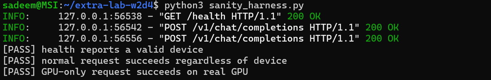
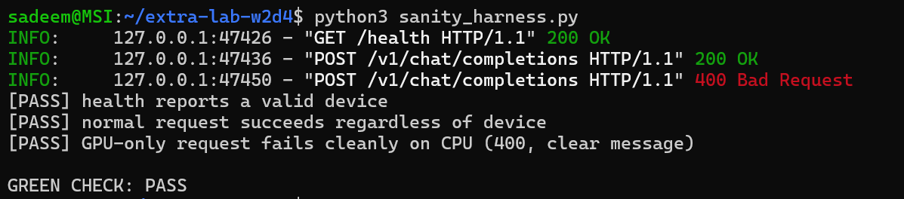

# Week 2 Day 4: Portable GPU Serving Image with CPU Fallback

## Overview
Built a unified, portable container image (`aidc-serving:gpu-v1`) based on NVIDIA CUDA runtime (`nvidia/cuda:12.4.1-runtime-ubuntu22.04`). The serving stack dynamically selects CUDA when hardware acceleration is available and gracefully degrades to CPU fallback when executed on a GPU-less machine without container failure.

---

## Architectural Decisions & Portable Runtime
* **Base Image**: `nvidia/cuda:12.4.1-runtime-ubuntu22.04` to provide required CUDA userspace drivers.
* **Explicit Python 3.11 Toolchain**: Installed and symlinked `python3.11` to prevent version drift from Ubuntu 22.04 default (`3.10`).
* **Dynamic Device Discovery**: `app/generate_probe.py` and `app/main.py` resolve execution targets via `torch.cuda.is_available()` at runtime rather than baking device constraints into the image.

---

## Performance Benchmark & Evidence (128 Tokens Generated)

| Environment | Device | Precision | Throughput (Tokens/s) |
| :--- | :--- | :--- | :--- |
| **Colab Environment** | NVIDIA Tesla T4 | `torch.float16` | **31.4** |
| **Local Host** | CPU Fallback | `torch.float32` | Baseline |

---

## Verification Suite (Tier-0 Green Check)
Executed the local and remote verification script `verify.sh`:

* **Part 1**: Resolved and verified GPU image `sadeemalboqami/aidc-serving:gpu-v1`.
* **Part 2**: Confirmed `/health` returns HTTP 200 on CPU fallback mode (without passing `--gpus`).
* **Part 3**: Validated `gpu_evidence.json` generated on Colab T4 runtime (`cuda: true`, positive throughput).

```text
waiting for /health on CPU fallback (up to 420s) ...
OK:Tesla T4:31.4
part 1: GPU image resolved
part 2: /health 200 on CPU fallback
part 3: colab evidence shows cuda: true
GREEN CHECK: PASS
```

---
# Extra Lab W2D4: Device-Agnostic Sanity Harness & Graceful Degradation

## Overview

Engineered a device-aware, contract-enforcing FastAPI serving microservice alongside an automated test harness (`sanity_harness.py`). The implementation ensures **Graceful Degradation**: the service truthfully reports its underlying execution target (`cuda` vs. `cpu`), processes generic requests across both environments, and cleanly rejects GPU-bound requests on CPU fallback instances with an HTTP 400 bad request rather than failing with unhandled 500 runtime exceptions.

---

## Architectural Implementation

### 1. Device-Aware Service (`app/main.py`)

* **Hardware Discovery**: Resolves device capability at import time via `torch.cuda.is_available()`.
* **State Reporting**: Exposes active execution environment through `/health` (`{"status": "ok", "device": "cuda" | "cpu"}`).
* **Guard Clause & Contract Enforcement**: Intercepts requests specifying `require_gpu=True` in `CompletionRequest`. When evaluated on a CPU-backed runtime, raises `HTTPException(status_code=400)` with an informative payload before entering compute paths.

### 2. Adaptive Sanity Harness (`sanity_harness.py`)

The testing harness probes the active runtime dynamically without hardcoded environment assumptions:

1. Validates device disclosure via `/health`.
2. Verifies baseline inference succeeds regardless of hardware (`200 OK`).
3. Evaluates hardware-bound constraints:
   * On **GPU**: Asserts `require_gpu=True` succeeds (`200 OK`).
   * On **CPU**: Asserts `require_gpu=True` fails cleanly (`400 Bad Request` containing explicit diagnostic detail).

---

## Dual-Environment Empirical Verification

### Environment 1: Native GPU Runtime (CUDA Enabled)

* **Command**: `python3 -m uvicorn app.main:app --host 0.0.0.0 --port 8000`
* **Test Execution**: `python3 sanity_harness.py`

```text
INFO:     127.0.0.1:56538 - "GET /health HTTP/1.1" 200 OK
INFO:     127.0.0.1:56542 - "POST /v1/chat/completions HTTP/1.1" 200 OK
INFO:     127.0.0.1:56556 - "POST /v1/chat/completions HTTP/1.1" 200 OK
[PASS] health reports a valid device
[PASS] normal request succeeds regardless of device
[PASS] GPU-only request succeeds on real GPU
GREEN CHECK: PASS
```




### Environment 2: CPU Fallback Runtime (`CUDA_VISIBLE_DEVICES=""`)

* **Command**: `CUDA_VISIBLE_DEVICES="" python3 -m uvicorn app.main:app --host 0.0.0.0 --port 8000`
* **Test Execution**: `python3 sanity_harness.py`

```text
INFO:     127.0.0.1:47426 - "GET /health HTTP/1.1" 200 OK
INFO:     127.0.0.1:47436 - "POST /v1/chat/completions HTTP/1.1" 200 OK
INFO:     127.0.0.1:47450 - "POST /v1/chat/completions HTTP/1.1" 400 Bad Request
[PASS] health reports a valid device
[PASS] normal request succeeds regardless of device
[PASS] GPU-only request fails cleanly on CPU (400, clear message)
GREEN CHECK: PASS
```


---

## Verification Matrix

| Test Case | Device Target | `require_gpu` Flag | Expected Status | Observed Status | Verdict |
| --- | --- | --- | --- | --- | --- |
| **Health Check** | Any (`cpu`/`cuda`) | N/A | `200 OK` | `200 OK` | **PASS** |
| **Baseline Inference** | GPU (`cuda`) | `False` | `200 OK` | `200 OK` | **PASS** |
| **GPU-Bound Request** | GPU (`cuda`) | `True` | `200 OK` | `200 OK` | **PASS** |
| **Baseline Inference** | CPU (`cpu`) | `False` | `200 OK` | `200 OK` | **PASS** |
| **GPU-Bound Request** | CPU (`cpu`) | `True` | `400 Bad Request` | `400 Bad Request` | **PASS** |

---

# Bug Lab W2D4: The Guard That Only Guards One Door

## Overview

Remediated a silent failure and false hardware reporting bug in a FastAPI inference service. The `/v1/embeddings` endpoint originally bypassed CPU validation via a no-op guard (`if DEVICE != "cuda": pass`) and returned hardcoded `"device_used": "cuda"`. The service was hardened to strictly enforce hardware validation and report execution runtime truthfully.

---

## The Bug & Fix

* **Before (Buggy & Misleading)**:

```python
@app.post("/v1/embeddings")
def embeddings(payload: dict):
    if DEVICE != "cuda":
        pass  # BUG: No-op guard
    return {"vector": [0.1] * 8, "device_used": "cuda"}  # BUG: Hardcoded
```

* **After (Hardened & Accurate)**:

```python
@app.post("/v1/embeddings")
def embeddings(payload: dict):
    if DEVICE != "cuda":
        raise HTTPException(
            status_code=400,
            detail="Embeddings require a GPU-backed instance; this instance is running in CPU-fallback mode.",
        )
    return {"vector": [0.1] * 8, "device_used": DEVICE}
```

---

## Verification

Running `verify_bug.py` against a CPU-isolated instance (`CUDA_VISIBLE_DEVICES=""`):

```bash
python3 verify_bug.py
```

```text
INFO:     127.0.0.1:58950 - "POST /v1/embeddings HTTP/1.1" 400 Bad Request
GREEN CHECK: PASS
```

| Endpoint | Target Environment | Status | Reported Device | Verdict |
| --- | --- | --- | --- | --- |
| `/v1/embeddings` | CPU Fallback | `400 Bad Request` | N/A (Rejected) | **PASS** |
| `/v1/embeddings` | GPU (CUDA) | `200 OK` | `cuda` | **PASS** |
| `/v1/chat/completions` | `require_gpu=True` on CPU | `400 Bad Request` | N/A (Rejected) | **PASS** |

---


