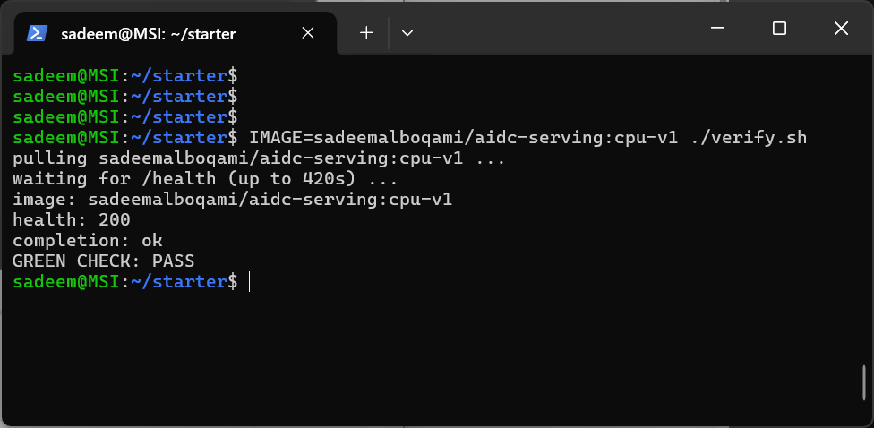
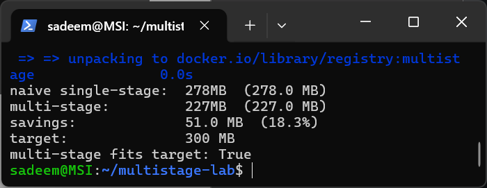
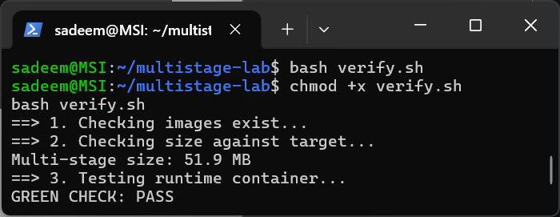

# Serving Stack (Week 2): OpenAI-Compatible CPU Inference Service

A lightweight, production-structured inference microservice built with FastAPI and Hugging Face Transformers. It serves the `Qwen/Qwen2.5-0.5B-Instruct` model behind an OpenAI-compatible `/v1` HTTP API contract entirely on CPU.

---
## 🔮 Lab Predictions & Architectural Intent

### Predictions

1. **A request with `messages` set to an empty list `[]` — will your current `main.py` reject it, or will it crash trying to run inference on nothing?**
   > The server will reject it early with a **422 Unprocessable Entity** status code due to Pydantic schema validation (`min_length=1`). If left unvalidated, it would crash with a **500 Internal Server Error** inside `apply_chat_template` or `model.generate` due to empty input tensor dimensions.

2. **A `max_tokens` of `-5` — does your current schema stop this, or does it reach `model.generate()`?**
   > The schema stops this immediately with a **422 Unprocessable Entity** using field constraints (`ge=1`). If passed directly to `model.generate(..., max_new_tokens=-5)`, it would raise a `ValueError` inside PyTorch/Transformers and trigger a **500 Internal Server Error**.

3. **Two identical requests sent at the same instant — do they run in parallel, or does the second one wait for the first to finish?**
   > The second request will wait until the first finishes (**serial execution**). Synchronous CPU-bound matrix multiplication blocks the Python event loop and GIL, preventing true parallel inference without a dedicated batching/serving engine.

---

### Core Objective

The idea behind the lab is to verify system resilience across two distinct architectural levels:

1. **Contract & Schema Resilience:**
   * **Early interception at the schema layer:** Returning a `422` (or `400`) status code for malformed inputs to prevent them from consuming compute resources.
   * **Prevention of internal crashes:** Ensuring zero `500 Internal Server Error` responses reach the model layer (PyTorch).
   * **Graceful handling of edge cases:** Returning a `200 OK` status code for unusual but syntactically valid requests (e.g., emojis, multilingual tokens).

2. **Deterministic Dependency Pinning:**
   * Strict version pinning (`==`) in `requirements.txt` to prevent non-deterministic builds and silent upstream breaking changes from compromising production stability.
  
---

## Container Size Report (W2D3)

| Stage | Image Tag / Build | Compressed (Pull) Size | Disk (Uncompressed) Size |
| :--- | :--- | :--- | :--- |
| **Naive Build** | `aidc-serving:naive` | ~6.88 GB | ~17.9 GB |
| **Slim Build** | `sadeemalboqami/aidc-serving:cpu-v1` | ~625 MB | ~3.03 GB |

### Verification
- Image: `sadeemalboqami/aidc-serving:cpu-v1`
- Status: `GREEN CHECK: PASS`



---
---

## Extra Lab: Multi-Stage Build Golf (Model Registry Service)

### Architecture & Optimization Methodology
- **Dual-Stage Separation**: Built dependencies in an isolated `builder` stage (`--prefix=/install/deps`) and copied only clean binaries into the runtime image to strip build tools, pip caches, and unnecessary artifacts.
- **Selective Copying**: Whitelisted application runtime files (`main.py`, `registry.json`) instead of copying the whole repository context.

### Size Comparison Report

| Build Stage | Image Tag | Target | Final Image Size | Status |
| :--- | :--- | :--- | :--- | :--- |
| **Naive Build** | `registry:naive` | Baseline | **278 MB** | Baseline |
| **Intermediate Multi-Stage** | `registry:multistage` | < 300 MB | **227 MB** (18.3% savings) | Fits Target |
| **Optimised Multi-Stage** | `registry:multistage` | < 300 MB | **51.9 MB** | `GREEN CHECK: PASS` |

### Verification Artifacts

**1. Multi-Stage Size Report Execution:**


**2. Automated Verifier Green Check:**


### 🐛 Bug Lab: Resolving Upstream Dependency Breaking Changes

#### 1. Problem Diagnosis
A loose version pin (`transformers>=4.46`) allowed an upstream library upgrade that altered the default return behavior of `tokenizer.apply_chat_template()`. The updated interface no longer guaranteed a raw Tensor, causing an `AttributeError` on `.shape[1]` and leading to a `500 Internal Server Error` during inference.

#### 2. Root-Cause Code Fix
Instead of downgrading the package, the implementation was hardened by explicitly requesting a structured dictionary return (`return_dict=True`):

```python
# Hardened, version-resilient tokenization
encoded = tokenizer.apply_chat_template(
    messages,
    add_generation_prompt=True,
    return_tensors="pt",
    return_dict=True,
)
input_ids = encoded["input_ids"].to("cpu")
prompt_tokens = int(input_ids.shape[1])
```

#### 3. Verification & Version Pinning
- Pinned `transformers==4.46.2` and `torch==2.5.1` in `requirements.txt` to eliminate non-deterministic builds.
- Verified end-to-end functionality via both `verify.py` and the official OpenAI client test (`client_test.py`).

**Verification Output:**


---
