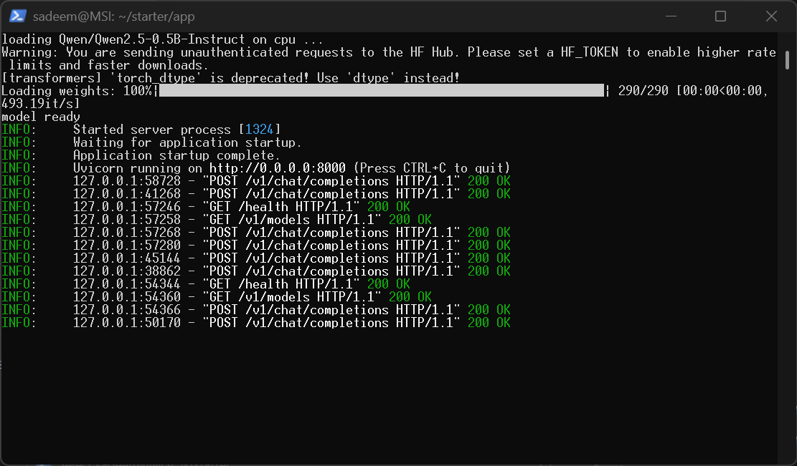
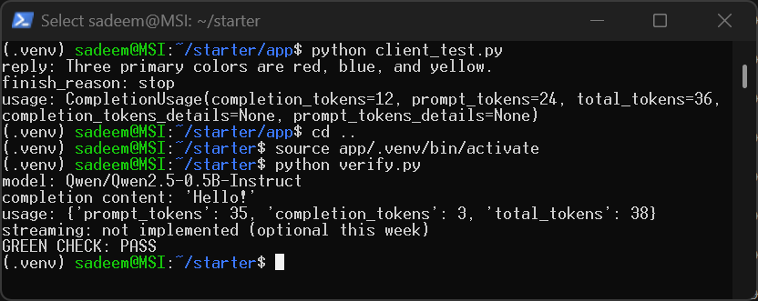
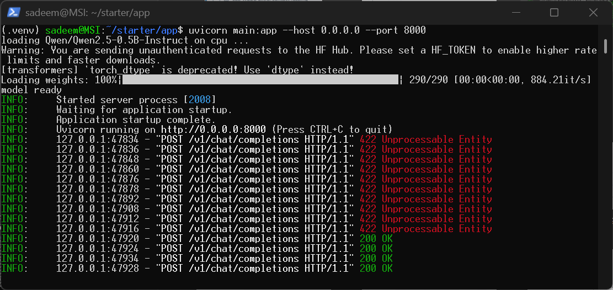
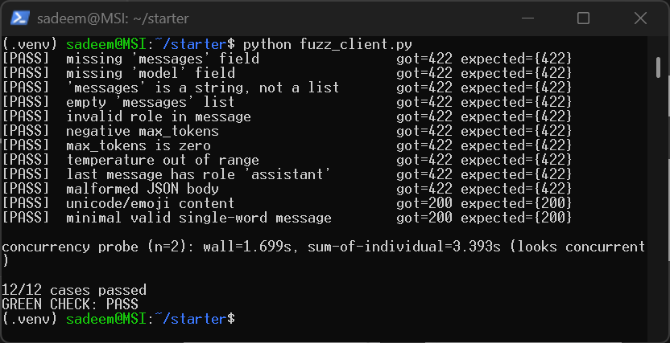
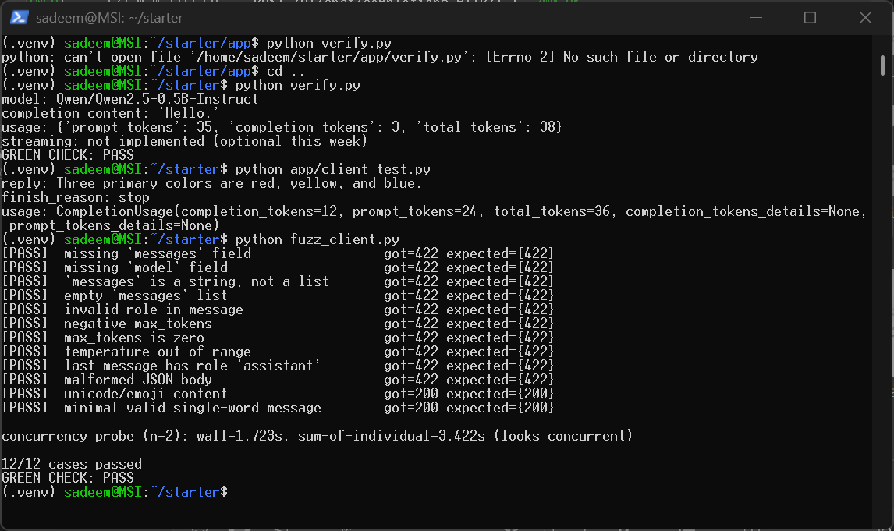

# Serving Stack (Week 2): OpenAI-Compatible CPU Inference Service

A lightweight, production-structured inference microservice built with FastAPI and Hugging Face Transformers. It serves the `Qwen/Qwen2.5-0.5B-Instruct` model behind an OpenAI-compatible `/v1` HTTP API contract entirely on CPU.

---
## 🔮 Lab Predictions & Architectural Intent

### Predictions

1. **A request with `messages` set to an empty list `[]` — will your current `main.py` reject it, or will it crash trying to run inference on nothing?**
   > The server will reject it early with a **422 Unprocessable Entity** status code due to Pydantic schema validation (`min_length=1`). If left unvalidated, it would crash with a **500 Internal Server Error** inside `apply_chat_template` or `model.generate` due to empty input tensor dimensions.

2. **A `max_tokens` of `-5` — does your current schema stop this, or does it reach `model.generate()`?**
   > The schema stops this immediately with a **422 Unprocessable Entity** using field constraints (`ge=1`). If passed directly to `model.generate(..., max_new_tokens=-5)`, it would raise a `ValueError` inside PyTorch/Transformers and trigger a **500 Internal Server Error**.

3. **Two identical requests sent at the same instant — do they run in parallel, or does the second one wait for the first to finish?**
   > The second request will wait until the first finishes (**serial execution**). Synchronous CPU-bound matrix multiplication blocks the Python event loop and GIL, preventing true parallel inference without a dedicated batching/serving engine.

---

### Core Objective

The idea behind the lab is to verify system resilience across two distinct architectural levels:

1. **Contract & Schema Resilience:**
   * **Early interception at the schema layer:** Returning a `422` (or `400`) status code for malformed inputs to prevent them from consuming compute resources.
   * **Prevention of internal crashes:** Ensuring zero `500 Internal Server Error` responses reach the model layer (PyTorch).
   * **Graceful handling of edge cases:** Returning a `200 OK` status code for unusual but syntactically valid requests (e.g., emojis, multilingual tokens).

2. **Deterministic Dependency Pinning:**
   * Strict version pinning (`==`) in `requirements.txt` to prevent non-deterministic builds and silent upstream breaking changes from compromising production stability.
  
---

## 📌 Features & API Contract

- **`GET /health`** — Liveness and readiness probe returning service and model status.
- **`GET /v1/models`** — Returns the served model metadata formatted as a standard OpenAI `ModelList`.
- **`POST /v1/chat/completions`** — Non-streaming completions endpoint supporting chat templates, token slicing, finish reason determination, and full usage metrics.

---

## 🛠️ Tech Stack & Dependencies

- **Framework:** FastAPI, Uvicorn
- **Model:** `Qwen/Qwen2.5-0.5B-Instruct`
- **Inference Engine:** Hugging Face `transformers` (v4.46.2), PyTorch CPU (v2.5.1)
- **Validation:** Pydantic v2

---

## 🚀 Setup & Execution

### 1. Environment Setup

```bash
cd app
python3 -m venv .venv
source .venv/bin/activate
pip install --index-url https://download.pytorch.org/whl/cpu --extra-index-url https://pypi.org/simple -r requirements.txt
```

### 2. Start the Server

```bash
uvicorn main:app --host 0.0.0.0 --port 8000 --reload
```

---

## 🧪 Verification & Testing

### 1. Server Execution & 200 OK Endpoints
Logs showing successful initialization of `Qwen/Qwen2.5-0.5B-Instruct` and healthy responses across `/health`, `/v1/models`, and `/v1/chat/completions`:



### 2. Client Test & Full Verification Pass
Successful inference via the official OpenAI client followed by the test suite pass:



---

### 3. Contract Fuzzing Suite (Extra Lab)

Run adversarial and malformed payload tests to verify schema resilience against invalid inputs:

```bash
python fuzz_client.py
```

#### Result & Server Interception:

1. Server-Side Request Interception
Uvicorn access logs demonstrating strict Pydantic validation intercepting invalid payloads with `422 Unprocessable Entity` before compute dispatch, while allowing valid requests with 200 OK:



2. Test Suite Execution & Concurrency Probe
Full test run achieving a `12/12` pass rate (`GREEN CHECK: PASS`) and confirming expected serial execution for synchronous CPU inference:



---

### 🐛 Bug Lab: Resolving Upstream Dependency Breaking Changes

#### 1. Problem Diagnosis
A loose version pin (`transformers>=4.46`) allowed an upstream library upgrade that altered the default return behavior of `tokenizer.apply_chat_template()`. The updated interface no longer guaranteed a raw Tensor, causing an `AttributeError` on `.shape[1]` and leading to a `500 Internal Server Error` during inference.

#### 2. Root-Cause Code Fix
Instead of downgrading the package, the implementation was hardened by explicitly requesting a structured dictionary return (`return_dict=True`):

```python
# Hardened, version-resilient tokenization
encoded = tokenizer.apply_chat_template(
    messages,
    add_generation_prompt=True,
    return_tensors="pt",
    return_dict=True,
)
input_ids = encoded["input_ids"].to("cpu")
prompt_tokens = int(input_ids.shape[1])
```

#### 3. Verification & Version Pinning
- Pinned `transformers==4.46.2` and `torch==2.5.1` in `requirements.txt` to eliminate non-deterministic builds.
- Verified end-to-end functionality via both `verify.py` and the official OpenAI client test (`client_test.py`).

**Verification Output:**



---
